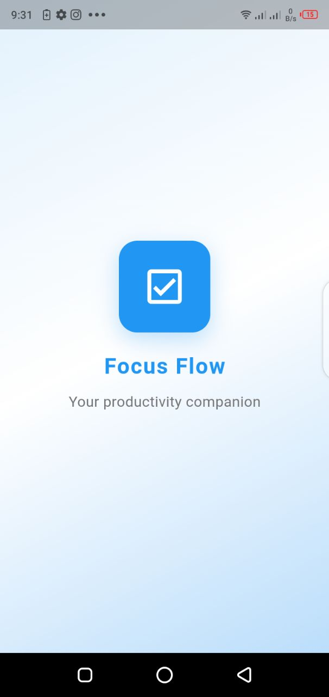
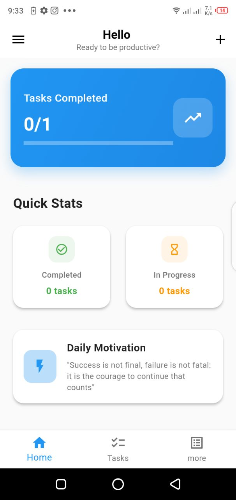
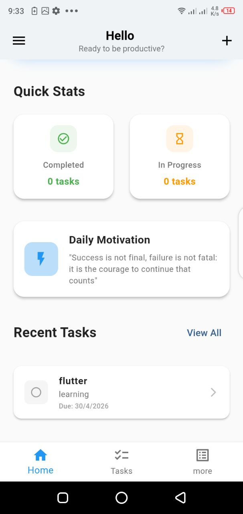
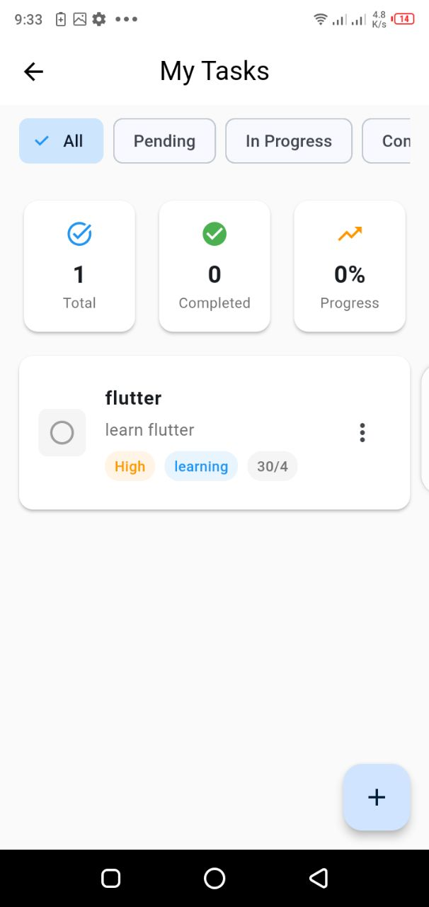
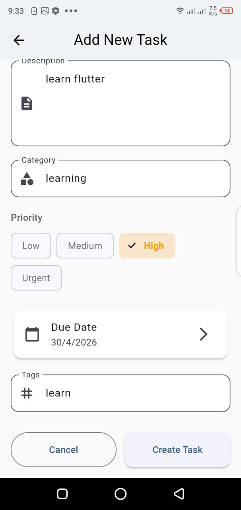
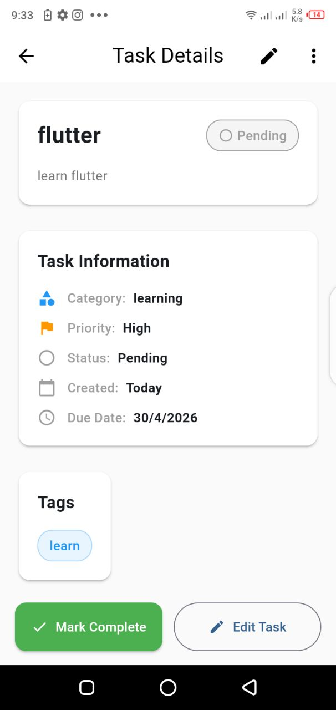
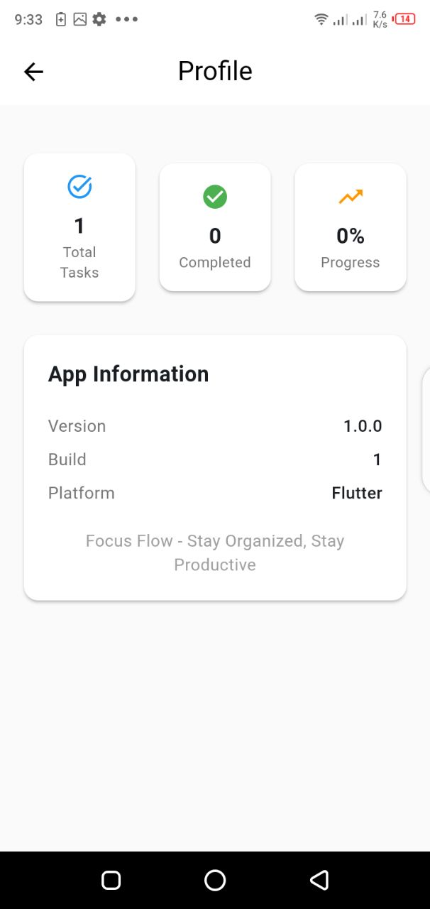

# FocusFlow — Task Management App

FocusFlow is a sleek **task management and productivity app** built with Flutter. It helps users organize daily tasks, set reminders, track progress, and improve focus with a clean and intuitive interface.

The app emphasizes simplicity and effective task tracking without unnecessary complexity.

---

##  Screenshots

<table>
  <tr>
    <td></td>
    <td></td>
    <td></td>
    <td></td>
  </tr>
  <tr>
    <td></td>
    <td></td>
    <td></td>
    <td></td>
  </tr>
</table>

---
